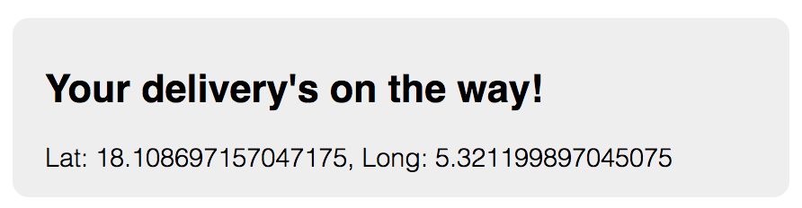
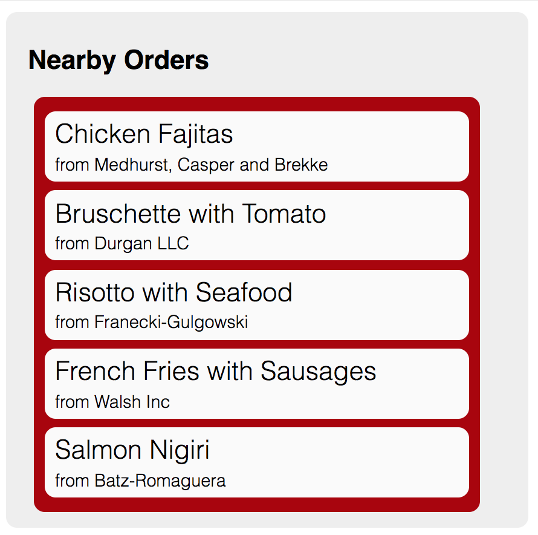
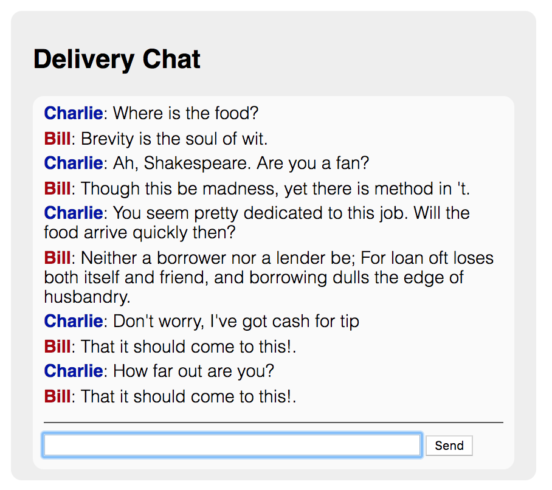

# Meal Delivery - Real Time Updates

1. [Overview](#overview)
2. [Features](#features)
	1. [Geolocation Tracking](#1-geolocation-tracking)
	2. [Activity Feed](#2-activity-feed)
	3. [Chat Messaging](#3-chat-messaging)
3. [Technical](#technical)
	1. [Stack](#stack)
	2. [Setup Instructions](#setup-instructions)

## Overview
This repo includes several proof-of-concept MVPs demonstrating how a meal delivery service can enhance their product using Pusher Channels to drive real time updates.

In this example, all features are designed to mimic the customer experience. They are all simultaneously embedded on the site's homepage. There is a separate admin interface which allows an admin to trigger non-customer facing events. The data generated by these events is then passed via Pusher Channels to the client.

* Home URL: http://localhost:3000
* Admin URL: http://localhost:3000/admin

## Features

### 1. Geolocation Tracking
This feature allows customers to see the realtime location of a delivery. This improves their experience and reassures the customer that their meal is on the way.

#### Usage
The client displays the latitude and longitude of the delivery person's last known location. When the delivery person's location updates, the client is automatically updated. 

#### Technical Explanation
The database stores all registered locations with lat/long coordinates. Whenever a new location is saved, it is published to a Pusher channel 'locations'.

The client subscribes to the same 'locations' channel. Whenever a new location is saved, the client receives the new lat/long coordinates and displays them to the customer.

The admin can generate and save a new location by clicking the "Create Location" button in the admin dashboard.

#### Future State
* Display locations as map markers instead of  text. 
* Generate locations automatically by the delivery person's device instead of a random generator.

---

### 2. Activity Feed
This feature displays a running list of what other people around the user are ordering. This improves the conversion rate from open-app to purchase.

#### Usage
The client automatically displays a list of the last 5 orders in your area. Whenever a new order is placed, the meal and restaurant is added to the list.

New orders are briefly highlighted in yellow to draw attention to the update.

#### Technical Explanation
The database stores all orders with the meal and the restaurant. Whenever a new order is made, it is published to a Pusher channel 'orders'. 

The client subscribes to the same 'orders' channel. Whenever a new order is made, the client receives the new order with meal and restaurant data. The new order is then added to the beginning of the display list and briefly highlighted in yellow via CSS effects. If the list already have five items, the last list item is removed.

The admin can generate and save new orders by clicking the "Create Order" button in the admin dashboard. The data in these new orders are randomly generated using the Faker Ruby gem.

#### Future State
* Implement a location service to limit the feed to only nearby customers and restaurants.

---

### 3. Chat Messaging
This feature allows the customer to chat directly with the delivery person from within the app without SMS. This ensures both can effectively communicate without the fear that a stranger will have their phone number forever.

#### Usage
The client displays a chat box to the customer. To send a message to the other party, they can input the message into a standard text box. Messages are distinguished by sender name. Names are colored for easy differentiation.

#### Technical Explanation
The database stores users, chats, and messages. Each chat includes a customer and a delivery person, which are referenced by user ID. Each message contains the message text, the chat ID and the sender ID (referring to a user). When a new message is saved, it is published to a Pusher channel 'chat-XX'. 

The client subscribes to the same 'chat-XX' channel and displays the chat's last 10 messages to the customer. When a new message is saved to the chat, the client recieves the new message and appends it to the chat display with the text and sender's name. If the customer sent the message, their name appears in blue. Other, the name appears in red.

The Pusher channel 'chat-XX' uses the chat ID as a security measure. This prevents other active chats from receiving each others' messages.

A customer can send a new custom message via a client-facing form. The admin can generate new messages from the delivery person by clicking the "Send Deliverer Message" in the admin dashboard. The data in these messages is generated by the Faker Ruby gem.

#### Future State
* Add an interface for the delivery person to craft custom messages.
* Randomize chat IDs so they cannot be guessed by third parties.

## Technical
### Stack
This repo uses the following technologies:
* [Ruby on Rails](https://rubyonrails.org/) - web server backend
* [Pusher](https://pusher.com) - real time communication APIs
* [jQuery](https://jquery.com) - frontend DOM manipulation
* [Postgres](https://www.postgresql.org) - database
* [Faker Gem](https://github.com/stympy/faker) - generated data content

### Setup Instructions
1. Clone the repository.
2. Install the gems.

		bundle install
		
3. Create a file `config/application.yml` and enter your Pusher credentials:

		PUSHER_APP_ID: 'XXXXXX'
		PUSHER_KEY: 'XXXXXXXXXXXXXXXXXXXX'
		PUSHER_SECRET: 'XXXXXXXXXXXXXXXXXXXX'
		PUSHER_CLUSTER: 'XXX'

4. Migrate the database:

		$ rails db:migrate

5. Launch the Rails server:

		$ rails server

You will now be able to access the site at http://localhost:3000.
